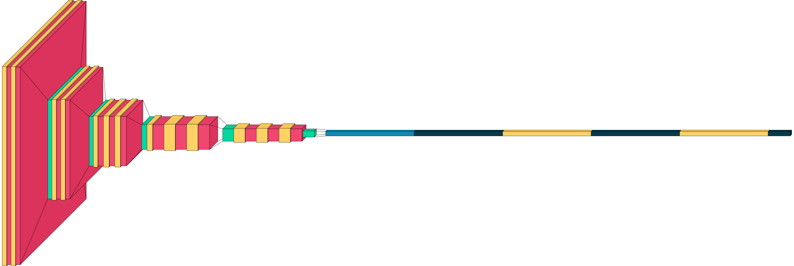
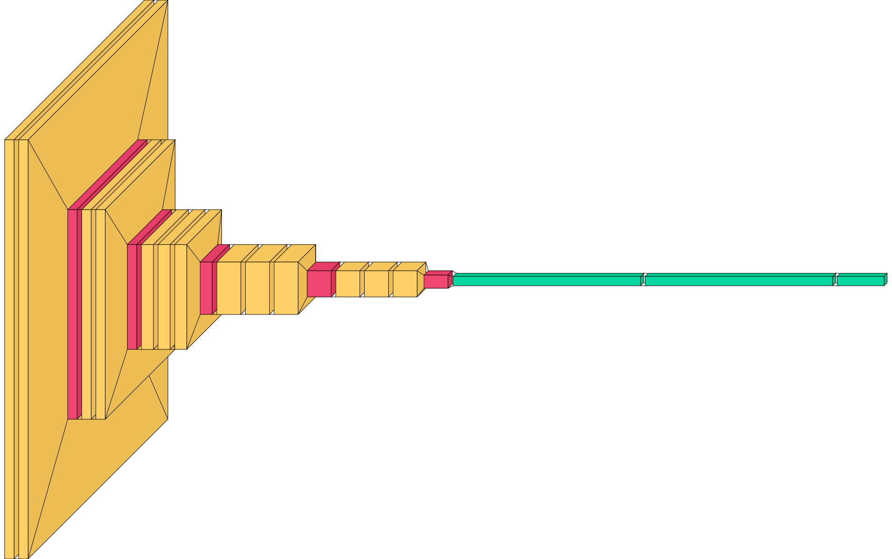

# visualkeras


## Introduction
Visualkeras is a Python package to help visualize Keras 1D and 2D neural network architectures. It allows easy styling to fit most 
needs. As of now it only supports layered style architecture generation which is great for CNNs (Convolutional Neural 
Networks).

## Installation
To install the current release:
```bash
pip install visualkeras
```
To update visual to the latest version, add --upgrade flag to the above commands.

## Usage

Generating neural network architectures is easy:
```python
import visualkeras

model = ...

visualkeras.layered_view(model).show() # display using your system viewer
visualkeras.layered_view(model, to_file='output.png') # write to disk
visualkeras.layered_view(model, to_file='output.png').show() # write and show
```

To help unerstand some of the most important parameters we are going to use a VGG16 CNN architecture (see [example.py](examples/example.py)).

###### Default
```python
visualkeras.layered_view(model)
```


###### Flat Style
```python
visualkeras.layered_view(model, draw_volume=False)
```


###### Spacing and logic grouping
The global distance between two layers can be controlled with `spacing`. To generate logical groups a special dummy 
keras layer `visualkeras.SpacingDummyLayer()` can be added.
```python

model = ...
...
model.add(visualkeras.SpacingDummyLayer(spacing=100))
...

visualkeras.layered_view(model, spacing=0)
```



###### Custom color map
It is possible to provide a custom color map for fill and outline per layer type.
```python
from tensorflow.python.keras.layers import Dense, Conv2D, Flatten, Dropout, MaxPooling2D, ZeroPadding2D
from collections import defaultdict

color_map = defaultdict(dict)
color_map[Conv2D]['fill'] = 'orange'
color_map[ZeroPadding2D]['fill'] = 'gray'
color_map[Dropout]['fill'] = 'pink'
color_map[MaxPooling2D]['fill'] = 'red'
color_map[Dense]['fill'] = 'green'
color_map[Flatten]['fill'] = 'teal'

visualkeras.layered_view(model, color_map=color_map)
```


###### Hiding layers
Some models may consist of too many layers to visualize or to comprehend the model. In this case it can be helpful to 
hide (ignore) certain layers of the keras model without modifying it. Visualkeras allows ignoring layers by their type
 (`type_ignore`) or index in the keras layer sequence (`index_ignore`).
```python
visualkeras.layered_view(model, type_ignore=[ZeroPadding2D, Dropout, Flatten])
```


###### Scaling dimensions
Visualkeras computes the size of each layer by the output shape. Values are transformed into pixels. Then, scaling is 
applied. By default visualkeras will enlarge the x and y dimension and reduce the size of the z dimensions as this has 
deemed visually most appealing. However, it is possible to control scaling using `scale_xy` and `scale_z`. Additionally, 
to prevent to small or large options minimum and maximum values can be set (`min_xy`, `min_z`, `max_xy`, `max_z`).  
```python
visualkeras.layered_view(model, scale_xy=1, scale_z=1, max_z=1000)
```

_Note: Scaled models may hide the true complexity of a layer, but are visually more appealing._

## Planned features
* Translucent layers
* Graph view for dense networks